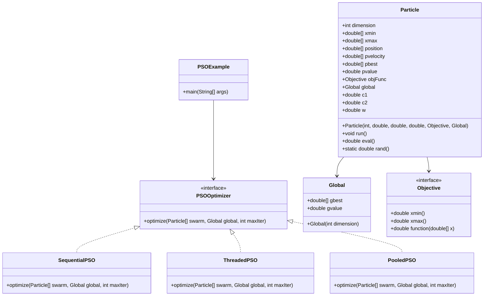
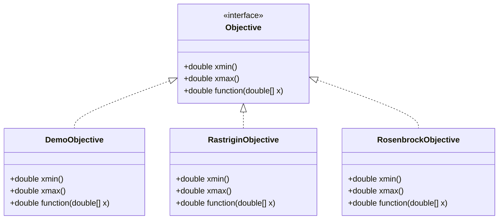

琪露诺的《面向对象程序设计》Java练习代码。

示例函数：rastrigin、rosenbrock

编译方式：javac -encoding utf-8 PSOExample.java

运行方式：java PSOExample

优化器类图结构：

```mermaid
classDiagram
    class PSOExample {
        +main(String[] args)
    }
    class PSOOptimizer {
        <<interface>>
        +optimize(Particle[] swarm, Global global, int maxIter)
    }
    class SequentialPSO {
        +optimize(Particle[] swarm, Global global, int maxIter)
    }
    class ThreadedPSO {
        +optimize(Particle[] swarm, Global global, int maxIter)
    }
    class PooledPSO {
        +optimize(Particle[] swarm, Global global, int maxIter)
    }
    class Particle {
        +int dimension
        +double[] xmin
        +double[] xmax
        +double[] position
        +double[] pvelocity
        +double[] pbest
        +double pvalue
        +Objective objFunc
        +Global global
        +double c1
        +double c2
        +double w
        +Particle(int, double, double, double, Objective, Global)
        +void run()
        +double eval()
        +static double rand()
    }
    class Global {
        +double[] gbest
        +double gvalue
        +Global(int dimension)
    }
    class Objective {
        <<interface>>
        +double xmin()
        +double xmax()
        +double function(double[] x)
    }

    PSOExample --> PSOOptimizer
    PSOOptimizer <|.. SequentialPSO
    PSOOptimizer <|.. ThreadedPSO
    PSOOptimizer <|.. PooledPSO
    Particle --> Objective
    Particle --> Global
```

目标函数类图结构：

```mermaid
classDiagram
    class Objective {
        <<interface>>
        +double xmin()
        +double xmax()
        +double function(double[] x)
    }

    class DemoObjective {
        +double xmin()
        +double xmax()
        +double function(double[] x)
    }
    class RastriginObjective {
        +double xmin()
        +double xmax()
        +double function(double[] x)
    }
    class RosenbrockObjective {
        +double xmin()
        +double xmax()
        +double function(double[] x)
    }

    Objective <|.. DemoObjective
    Objective <|.. RastriginObjective
    Objective <|.. RosenbrockObjective
```